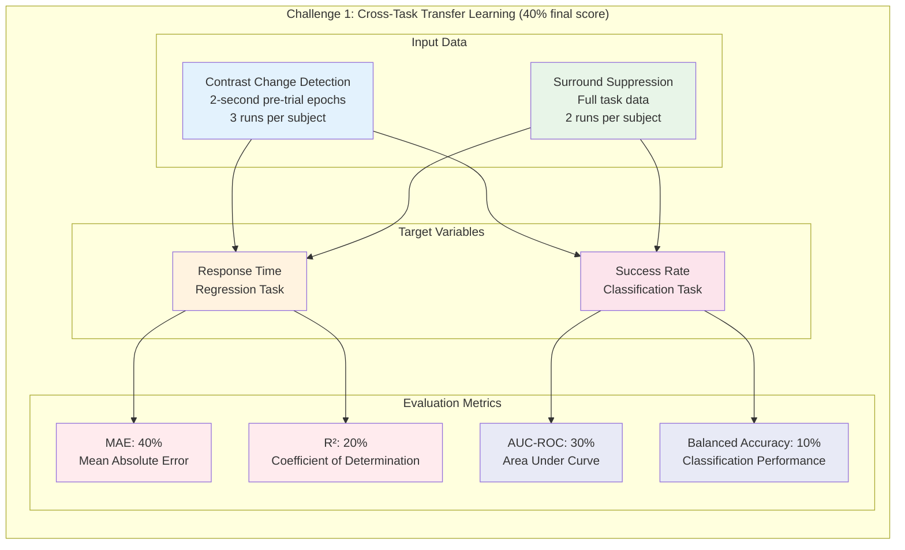
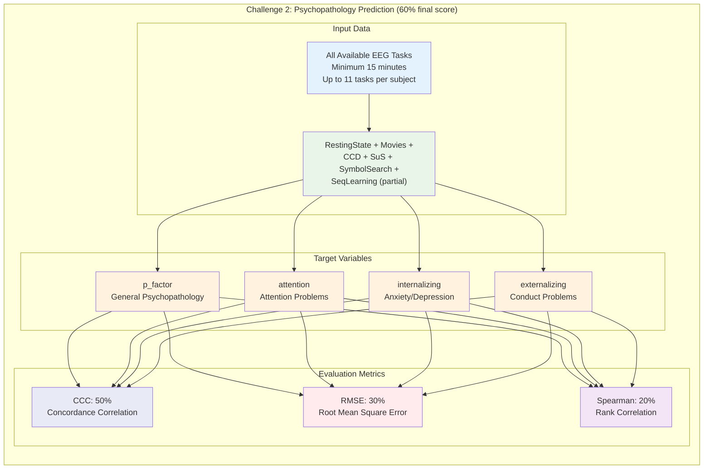
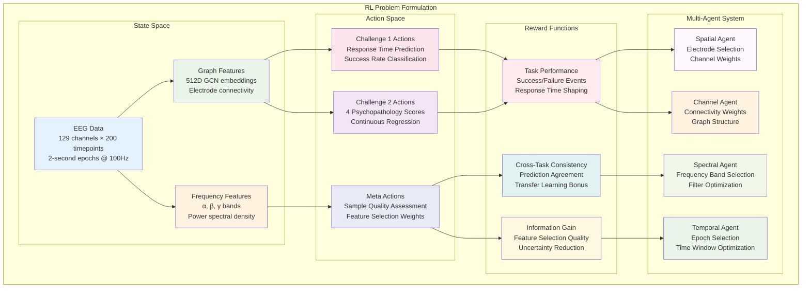
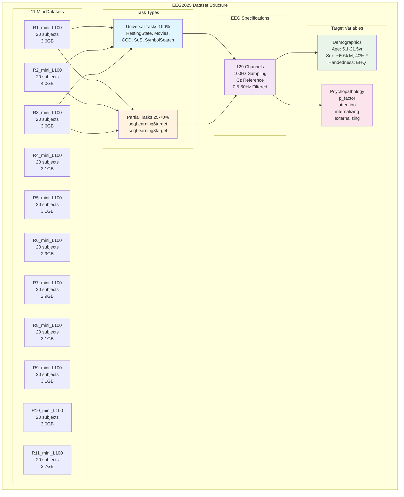
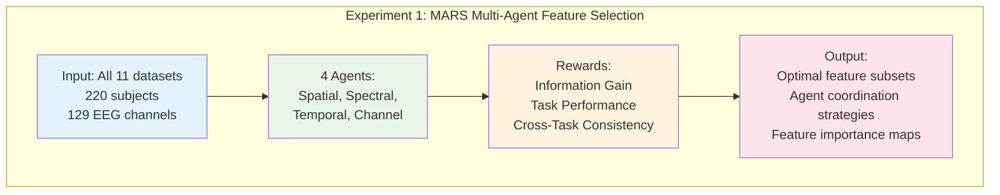
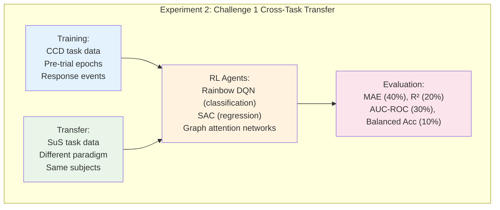
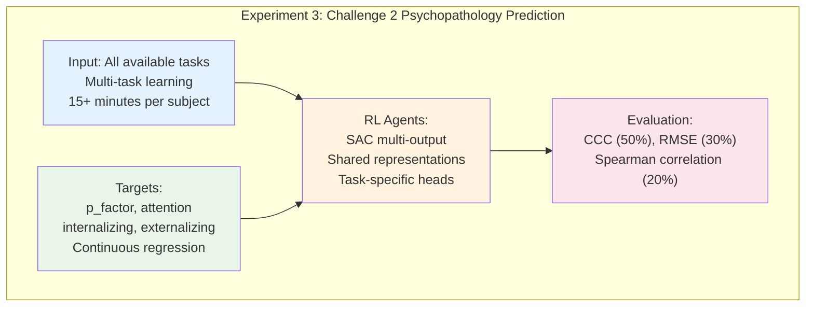
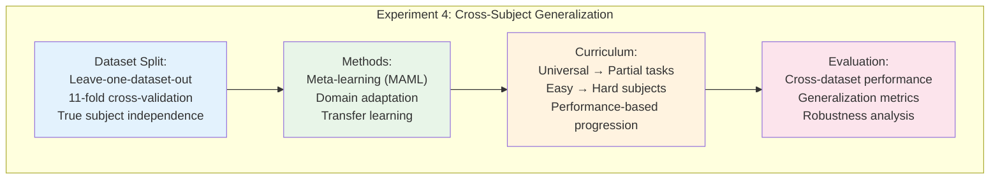
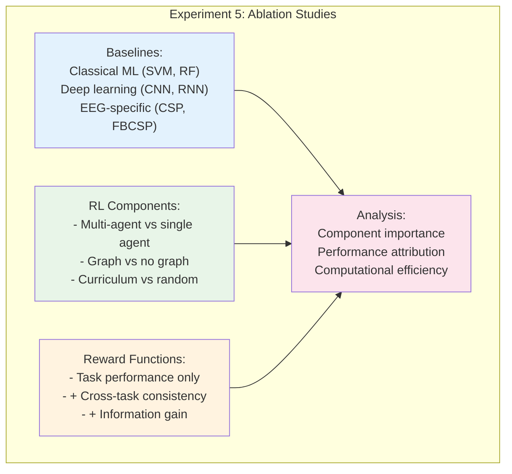

# Cerebro: RL-Based EEG Decoding for EEG2025 NeurIPS Challenge

An innovative reinforcement learning approach to the EEG2025 NeurIPS Challenge: "From Cross-Task to Cross-Subject EEG Decoding" using automated task-performance rewards and multi-agent systems.

## Challenge Overview

### EEG2025 NeurIPS Challenge
The challenge focuses on developing EEG decoders that can transfer knowledge across cognitive tasks and generalize across subjects using the HBN-EEG dataset (3000+ participants, 6 cognitive tasks).

**Key Requirements:**
- 128-channel Magstim EGI system data
- Downsampled to 100Hz, filtered 0.5-50Hz
- Single GPU inference with <20GB memory
- Code submission competition (not results)





### Challenge 1: Cross-Task Transfer Learning (40% final score)
- **Input**: 2-second pre-trial EEG epochs from Contrast Change Detection (CCD) + full Surround Suppression (SuS) data
- **Targets**: Response time (regression) + Success rate (classification)
- **Metrics**: MAE (40%), R² (20%), AUC-ROC (30%), Balanced Accuracy (10%)

### Challenge 2: Psychopathology Prediction (60% final score)
- **Input**: All available EEG tasks (minimum 15 minutes per subject)
- **Targets**: 4 continuous scores (p-factor, internalizing, externalizing, attention)
- **Metrics**: CCC (50%), RMSE (30%), Spearman correlation (20%)

## Our RL-Based Approach



### Key Innovations

1. **Task-Event Based Reward System**
   - Direct reward signals from task performance events (success/failure)
   - Response time and accuracy-based reward shaping
   - Multi-task reward balancing for generalization

2. **MARS Multi-Agent Feature Selection**
   - Spatial-Spectral Agent: Frequency band selection (0.5-50Hz)
   - Temporal Agent: Epoch selection for 2-second windows
   - Channel Agent: EEG electrode subset optimization
   - Counterfactual baseline for credit assignment

3. **EEG RL-Net with Graph Neural Networks**
   - Spectral graph convolution on electrode adjacency
   - Dueling DQN for sample quality assessment
   - Adaptive uncertainty-based sample weighting

4. **Automated Reward Architecture**
   - Task performance-based environmental rewards
   - Cross-task consistency rewards for transfer learning
   - Curriculum progression based on learning curves

## Data Structure



### Available Datasets
- **Mini Datasets**: 11 datasets (R1-R11) with 20 subjects each = **220 total subjects**
- **Size**: 35.1 GB total, 2.7-4.0GB per dataset
- **Format**: EEGLAB .set files (100Hz downsampled, no .fdt files)
- **Subject Distribution**: Completely disjoint across datasets ✅
- **EEG Files**: 2,610 total .set files (~220-240 per dataset)

### Challenge Data Availability

**Challenge 1 (Cross-Task Transfer)**: 
- **220 subjects** with both Contrast Change Detection + Surround Suppression
- **All 11 datasets** have complete CCD (3 runs) + SuS (2 runs) data
- Perfect for cross-task transfer learning experiments

**Challenge 2 (Psychopathology Prediction)**:
- **220 subjects** with 3+ tasks (sufficient for 15+ minute requirement)  
- **All subjects** have psychopathology scores: p_factor, attention, internalizing, externalizing
- Rich multi-task data: 11 total tasks across passive and active paradigms

### Technical Specifications
- **Sampling Rate**: 100Hz (downsampled from 500Hz)
- **Channels**: 129 channels (128 EEG + 1 reference Cz)
- **Reference**: Cz electrode
- **Filtering**: 60Hz notch filter applied
- **Age Range**: 5.1 - 21.5 years (pediatric to young adult)
- **Demographics**: ~60% male, 40% female across datasets

### Task Breakdown
**Universal Tasks** (100% availability):
- RestingState, DespicableMe, DiaryOfAWimpyKid, FunwithFractals, ThePresent
- contrastChangeDetection (3 runs), surroundSupp (2 runs), symbolSearch

**Partial Tasks**:
- seqLearning6target: 25-45% availability across datasets
- seqLearning8target: 50-70% availability across datasets

## Technical Architecture

### Core Components

```
├── eeg_preprocessing/           # GNN-based feature extraction
├── reward_systems/             # Task-performance based rewards
├── mars_agents/                # Multi-agent feature selection
├── eeg_rl_net/                # Dueling DQN with GCN
├── challenge_agents/           # Task-specific RL agents
├── training/                   # Curriculum learning orchestrator
├── evaluation/                 # Challenge-specific metrics
└── experiments/                # Configuration and runners
```

### State Space Design
- **Graph Features**: 512D spectral GCN embeddings from 129 EEG channels
- **Adjacency Matrix**: EGI 128-channel electrode position-based connectivity
- **Temporal Windows**: 2-second epochs at 100Hz sampling (200 time points)
- **Frequency Bands**: α (8-12Hz), β (12-30Hz), γ (30-50Hz) - optimized for 100Hz Nyquist

### Action Spaces
- **Challenge 1**: Continuous response time + binary success rate
- **Challenge 2**: 4 continuous psychopathology scores
- **Meta-Actions**: Skip ambiguous samples, optimize feature weights

## Roadmap

### Phase 1: Foundation (Weeks 1-2)
- [x] Project structure and documentation
- [ ] EEG preprocessing pipeline with GNN features
- [ ] Task-performance reward system implementation
- [ ] Basic data loading and validation

### Phase 2: Core RL Systems (Weeks 3-4)
- [ ] MARS multi-agent feature selection
- [ ] EEG RL-Net with dueling DQN
- [ ] Automated reward signal integration
- [ ] Experience replay with prioritization

### Phase 3: Challenge Implementation (Weeks 5-6)
- [ ] Challenge 1 DDPG agent (cross-task transfer)
- [ ] Challenge 2 multi-output regression agent
- [ ] Transfer learning between mini datasets
- [ ] Curriculum learning orchestrator

### Phase 4: Optimization (Weeks 7-8)
- [ ] Hyperparameter optimization with evolutionary search
- [ ] Model compression for GPU memory constraints
- [ ] Cross-subject domain adaptation
- [ ] Uncertainty quantification and sample selection

### Phase 5: Evaluation & Submission (Weeks 9-10)
- [ ] Comprehensive evaluation on all metrics
- [ ] Ablation studies on RL components
- [ ] Final model selection and ensemble
- [ ] Submission preparation and documentation

## Experimental Design











## Key References

Based on state-of-the-art research in EEG + RL:

1. **Vukelić et al. (2023)**: BCI + Deep RL for robot training with ErrP feedback
2. **Shin et al. (2024)**: MARS multi-agent RL for EEG feature selection
3. **Aung et al. (2024)**: EEG_RL-Net with graph neural networks
4. **Luo et al. (2018)**: Deep RL from error-related potentials

## Usage

```bash
# Set up environment
uv run python setup.py

# Download and preprocess mini datasets
uv run python scripts/download_mini_datasets.py

# Train task-performance reward system
uv run python scripts/train_reward_system.py

# Run Challenge 1 experiments
uv run python experiments/challenge1_transfer_learning.py

# Run Challenge 2 experiments  
uv run python experiments/challenge2_psychopathology.py

# Evaluate and generate submission
uv run python scripts/generate_submission.py
```

## Expected Advantages

1. **Sequential Decision Making**: RL naturally handles temporal EEG data
2. **Automated Supervision**: Task performance events provide direct reward signals
3. **Adaptive Feature Selection**: Multi-agent optimization of spatial-spectral-temporal features
4. **Uncertainty Handling**: Skip difficult samples to improve overall accuracy
5. **Transfer Learning**: Pre-train on all tasks, fine-tune per challenge
6. **Task-Centered**: Incorporates natural task performance feedback mechanisms

## Design Choices & Trade-offs

### 1. EEG Preprocessing Pipeline

**Signal Processing:**
- **Filtering**: Butterworth vs Chebyshev vs FIR filters (0.5-50Hz)
- **Artifact Removal**: ICA vs ASR vs manual rejection
- **Epoching**: Fixed 2s windows vs adaptive sliding windows
- **Normalization**: Z-score vs Min-Max vs Robust scaling

**Feature Extraction:**
- **Time Domain**: Raw samples vs statistical moments vs autoregressive
- **Frequency Domain**: FFT vs Welch's PSD vs multitaper vs wavelet
- **Time-Frequency**: STFT vs CWT vs EMD vs Hilbert-Huang
- **Spatial**: Laplacian vs Common Spatial Patterns vs Source localization

**Graph Construction:**
- **Adjacency**: Euclidean distance vs correlation vs mutual information
- **Connectivity**: Static vs dynamic vs adaptive thresholding
- **Graph Types**: Undirected vs directed vs weighted vs binary

### 2. Task Performance Reward Systems

**Reward Signal Sources:**
- **Direct**: Task success/failure events from behavioral data
- **Temporal**: Response time-based reward shaping
- **Accuracy**: Correct vs incorrect response feedback

**Reward Design:**
- **Immediate**: Event-based rewards (button press outcomes)
- **Delayed**: Episode completion rewards
- **Shaped**: Distance-based or progress-based intermediate rewards

**Multi-Task Integration:**
- **Balanced**: Equal weighting vs task-difficulty adaptive
- **Hierarchical**: Primary task vs auxiliary task rewards
- **Consistency**: Cross-task performance correlation rewards

### 3. MARS Multi-Agent Feature Selection

**Agent Architecture:**
- **Spatial Agent**: Q-learning vs Policy Gradient vs Actor-Critic
- **Spectral Agent**: Discrete frequency bins vs continuous bands  
- **Temporal Agent**: Fixed epochs vs variable length sequences
- **Channel Agent**: Electrode subset selection vs attention weighting

**State Representation:**
- **Feature Space**: Raw features vs PCA vs autoencoders
- **History**: Current only vs temporal context vs full trajectory
- **Dimensionality**: Low-dim (64) vs medium (256) vs high (1024)

**Reward Design:**
- **Intrinsic**: Information gain vs diversity vs sparsity
- **Extrinsic**: Task performance vs computational efficiency
- **Multi-objective**: Pareto optimization vs weighted sum vs hierarchical

**Coordination:**
- **Communication**: Centralized vs decentralized vs emergent
- **Sharing**: Parameter sharing vs experience sharing vs gradient sharing
- **Competition**: Cooperative vs competitive vs mixed

### 4. EEG RL-Net with Graph Neural Networks

**Graph Neural Network:**
- **Architecture**: GCN vs GraphSAGE vs GAT vs Graph Transformer
- **Pooling**: Global mean vs attention vs set2set vs differentiable pooling
- **Normalization**: BatchNorm vs LayerNorm vs GraphNorm

**Dueling DQN Design:**
- **Value Function**: Separate streams vs shared backbone vs attention fusion
- **Action Selection**: ε-greedy vs Boltzmann vs UCB vs Thompson sampling
- **Target Network**: Fixed vs soft updates vs periodic resets

**Skip Mechanism:**
- **Uncertainty**: Entropy vs variance vs ensemble disagreement
- **Threshold**: Fixed vs adaptive vs learned
- **Cost**: Fixed penalty vs proportional vs learned cost function

### 5. Challenge-Specific Agents

**Challenge 1 (Cross-Task Transfer):**
- **Multi-task Learning**: Hard sharing vs soft sharing vs task-specific heads
- **Transfer Method**: Fine-tuning vs meta-learning vs domain adaptation
- **Loss Weighting**: Fixed vs adaptive vs curriculum-based

**Challenge 2 (Psychopathology):**
- **Regression Head**: Linear vs MLP vs attention-based
- **Loss Function**: MSE vs Huber vs quantile vs distributional
- **Regularization**: L1/L2 vs dropout vs batch normalization

**Cross-Subject Generalization:**
- **Domain Adaptation**: DANN vs CORAL vs MMD vs adversarial
- **Normalization**: Per-subject vs global vs adaptive batch norm
- **Meta-Learning**: MAML vs Reptile vs gradient-based vs metric-based

### 6. Training & Optimization

**RL Algorithm Choice:**
- **Value-Based**: DQN vs Double DQN vs Rainbow vs Distributional DQN
- **Policy-Based**: REINFORCE vs A2C vs PPO vs TRPO
- **Actor-Critic**: DDPG vs TD3 vs SAC vs MPO

**Experience Replay:**
- **Buffer Type**: Uniform vs prioritized vs hindsight vs episodic
- **Buffer Size**: Small (1K) vs medium (100K) vs large (1M+)
- **Sampling**: Random vs recency-weighted vs curriculum

**Curriculum Learning:**
- **Ordering**: Random vs difficulty-based vs diversity-based
- **Progression**: Fixed schedule vs adaptive vs self-paced
- **Subjects**: Easy-to-hard vs diverse sampling vs meta-learned order

**Hyperparameter Optimization:**
- **Method**: Grid search vs random vs Bayesian vs evolutionary
- **Budget**: Time-based vs evaluation-based vs adaptive
- **Multi-objective**: Single metric vs Pareto vs hierarchical

### 7. Automated Learning Integration

**Self-Supervised Signals:**
- **Consistency**: Cross-task prediction agreement
- **Temporal**: Sequential prediction accuracy
- **Spatial**: Cross-channel coherence measures

**Adaptive Learning:**
- **Online**: Real-time adaptation during training
- **Offline**: Batch optimization between episodes
- **Curriculum**: Automatic difficulty progression based on performance

### 8. Evaluation & Metrics

**Cross-Validation:**
- **Strategy**: K-fold vs leave-one-subject-out vs temporal splits
- **Stratification**: Random vs balanced by demographics vs task performance
- **Nested**: Simple CV vs nested CV vs time series CV

**Baseline Comparisons:**
- **Classical ML**: SVM vs Random Forest vs XGBoost
- **Deep Learning**: CNN vs RNN vs Transformer vs hybrid
- **Domain-Specific**: CSP + LDA vs FBCSP vs Riemannian geometry

**Statistical Testing:**
- **Significance**: t-test vs Wilcoxon vs permutation vs Bayesian
- **Correction**: Bonferroni vs FDR vs Holm vs Benjamini-Hochberg
- **Effect Size**: Cohen's d vs Glass's delta vs eta-squared

## Recommended Design Choices

Based on dataset analysis and literature:

1. **Preprocessing**: Butterworth 0.5-50Hz + ICA + Z-score normalization (handles 100Hz data)
2. **Graph**: EGI electrode correlation-based adjacency with adaptive thresholding  
3. **Rewards**: Task performance events + response time shaping + cross-task consistency
4. **MARS**: Actor-Critic agents with task-specific information gain rewards
5. **GNN**: Graph Attention Network with 129-channel connectivity
6. **RL**: SAC for Challenge 2 regression, Rainbow DQN for Challenge 1 classification
7. **Transfer**: Cross-dataset evaluation (11-fold) + meta-learning within datasets
8. **Evaluation**: Leave-one-dataset-out for true cross-subject generalization

## Revised RL Strategy

**Dataset Utilization**:
- **Training**: 9 datasets (180 subjects) 
- **Validation**: 1 dataset (20 subjects)
- **Testing**: 1 dataset (20 subjects)
- **Cross-validation**: 11-fold across datasets for robust evaluation

**Task-Specific Adaptations**:
- **Challenge 1**: Use CCD success/failure events for rewards, SuS for transfer validation
- **Challenge 2**: Multi-task learning across all 11 tasks per subject with balanced rewards
- **Curriculum**: Start with high-availability tasks, progress to partial tasks based on performance

## Hardware Requirements

- GPU: 20GB+ memory (RTX 4090, A100, H100)
- CPU: 16+ cores for parallel data processing
- RAM: 64GB+ for large dataset handling
- Storage: 100GB+ for datasets and model checkpoints