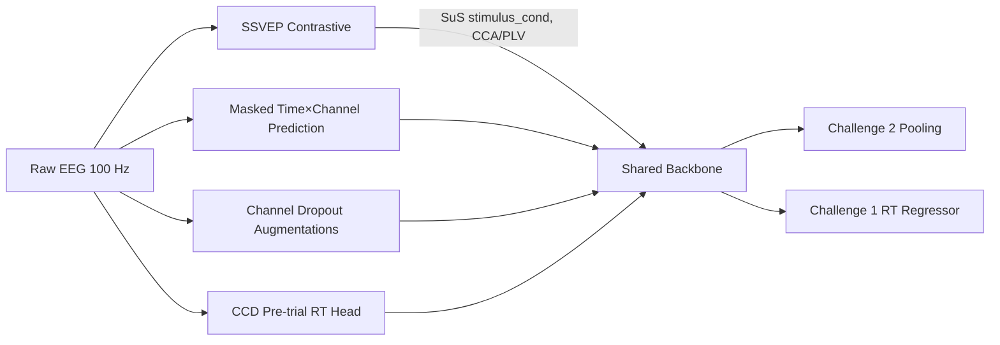

# Pretraining Objectives

This document summarizes the planned self-/unsupervised tasks and the protocol cues they rely on.

## Tier 1 (implement first)

| Task | Dataset cues | Notes |
| --- | --- | --- |
| Masked time×channel prediction | All tasks; short windows | BENDR/JEPA-style contrastive span prediction over masked regions. |
| SSVEP frequency/phase contrastive | `surroundSupp` (`stimulus_cond`, `foreground`), CCD flicker events | Use CCA/PLV features; positives share stimulus condition. |
| Channel dropout & mild augmentations | All tasks | Time masking, jitter, Gaussian noise, ≤10 % channel dropout. |
| CCD pre-trial RT regression | `contrastChangeDetection` (pre-trial windows, button presses, feedback) | Supervised head aligned with Challenge 1 objective; doubles as readiness proxy. |

## Tier 2 (optional if time permits)

| Task | Dataset cues | Notes |
| --- | --- | --- |
| Movie timestamp contrastive | Individual movie runs (start/stop markers) | Align embeddings across subjects by time since `video_start`. |
| Feedback-consistency clustering | CCD `feedback` column (`smiley_face`/`sad_face`) | Encourage separation of positive/negative feedback trials. |
| Eyes-open/closed proxy | `RestingState` (`instructed_toOpenEyes/CloseEyes`) | Lightweight supervised head for stability. |
| Sequence-learning objectives | `seqLearning6/8target` (`dot_noX_ON/OFF`, `learningBlock`) | Potential future contrastive or temporal tasks. |

All objectives operate at 100 Hz without additional filtering. Pretrained backbones feed both Challenge 2 (subject-level pooling) and Challenge 1 (RT regression) heads.
