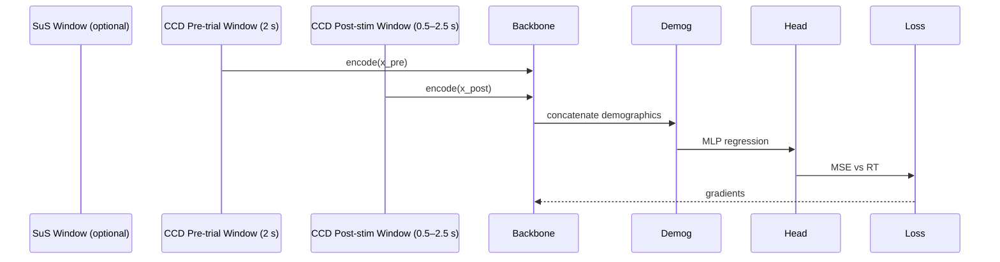

# CCD Pre-trial RT Regression Head

**Formulation**
- Input: 2 s pre-trial window (and optionally 0.5–2.5 s post-stim window) + demographics.
- Head: small MLP predicting response time; trained with MSE/nRMSE.
- Supports future ranking (quantile-based margin loss) if necessary.

**Supervision**
- Uses actual RT from CCD annotations (trial start → button press).
- Aligns backbone with Challenge 1 objective while sharing weights with C2 pipeline.
