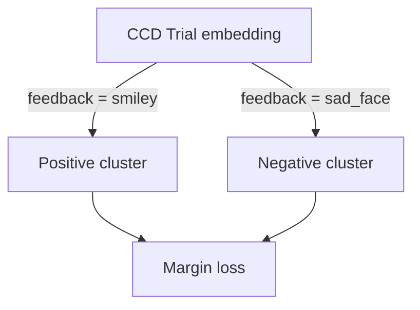

# Feedback-Consistency Clustering *(Tier 2)*

**Description**
- Uses CCD `feedback` labels (`smiley_face` vs. `sad_face`).
- Applies an intra-subject margin loss encouraging consistent embeddings within the same feedback class.

**Purpose**
- Provides a weak ErrP-inspired signal that may refine error-related features.
- Only pursue after core Tier 1 objectives are stable.
