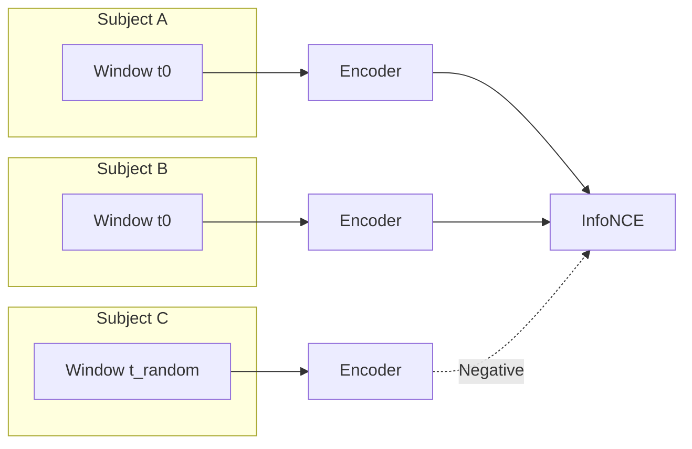

# Movie Timestamp Contrastive Learning *(Tier 2)*

**Inputs**
- Windows cropped at identical offsets relative to `video_start` (no per-scene markers).
- Negatives sampled from different timestamps or other movies.

**Objective**
- Pull embeddings of synchronized scenes together across subjects; push non-aligned windows apart.

**Use cases**
- Improves inter-subject coordination useful for Challenge 2 generalization.
