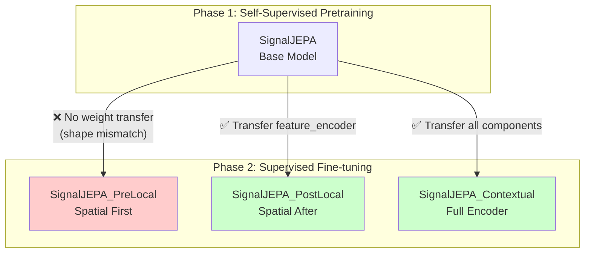
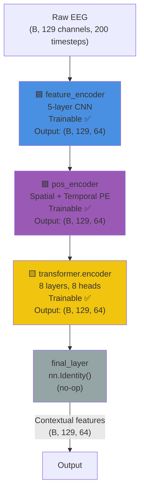
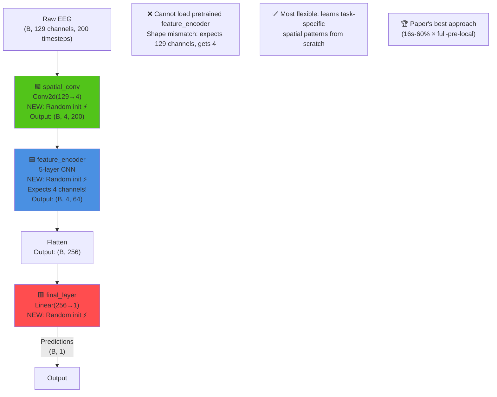
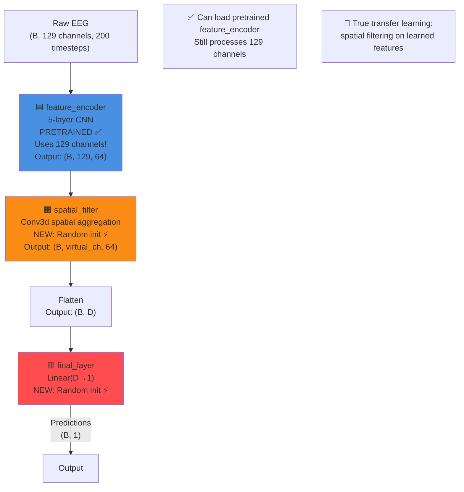
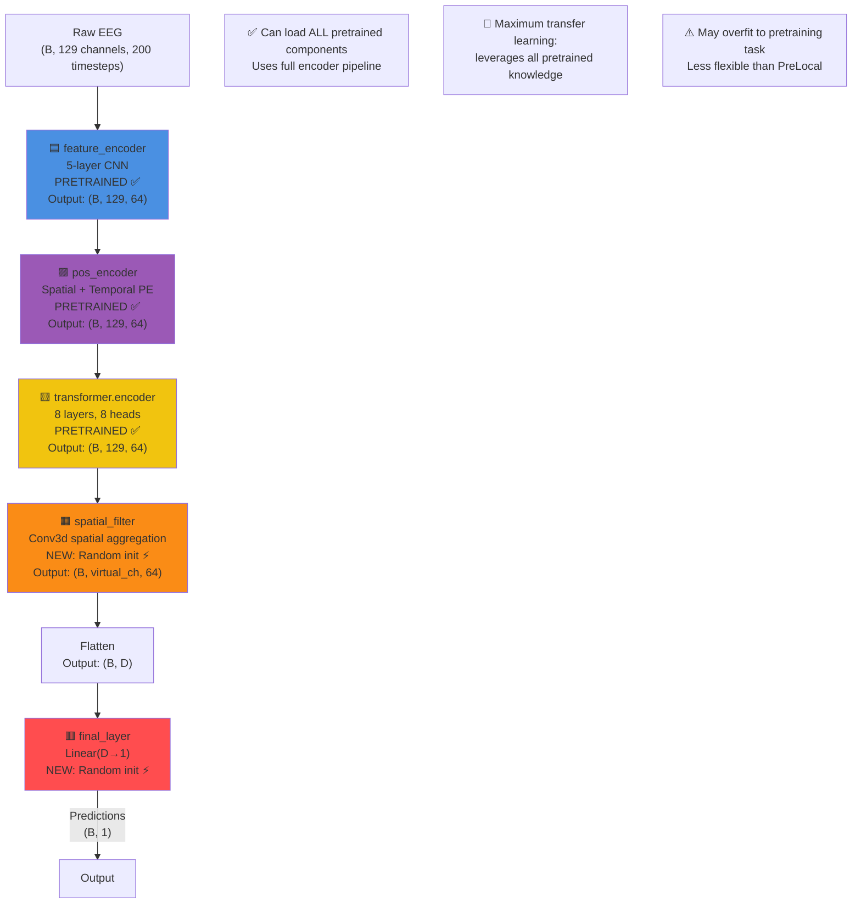
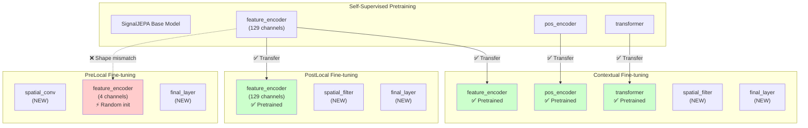

# SignalJEPA Architecture Comparison

This document explains the architectural differences between the base SignalJEPA model (for self-supervised pretraining) and its three downstream variants for supervised fine-tuning.

## Overview



---

## Component Legend

| Component | Description | Trainable During Pretraining | Used in Fine-tuning |
|-----------|-------------|------------------------------|---------------------|
| 🟦 **feature_encoder** | 5-layer CNN per-channel feature extraction | ✅ Yes | Depends on variant |
| 🟪 **pos_encoder** | Spatial + temporal positional encoding | ✅ Yes | Only Contextual |
| 🟨 **transformer** | 8-layer contextual encoder | ✅ Yes | Only Contextual |
| 🟩 **spatial_conv** | Spatial aggregation (NEW for fine-tuning) | ❌ No | PreLocal only |
| 🟧 **spatial_filter** | 3D conv spatial filter (NEW for fine-tuning) | ❌ No | PostLocal & Contextual |
| 🟥 **final_layer** | Task-specific output head (NEW for fine-tuning) | ❌ No | All variants |

---

## Architecture Diagrams

### Base SignalJEPA (Self-Supervised Pretraining)



**Purpose**: Learn general-purpose EEG representations via JEPA objective (predict masked tokens from visible context).

**Training Components**:
- External predictor (4-layer transformer decoder) predicts masked tokens
- External target encoder (EMA copy) provides targets
- Loss: L1 in embedding space

**What gets saved**: Only the base model weights (feature_encoder, pos_encoder, transformer)

---

### SignalJEPA_PreLocal (Spatial Filtering BEFORE Local Encoder)



**Key Insight**: The spatial convolution **reduces channels first** (129→4), so the feature_encoder expects 4 input channels, not 129. This creates an **architectural mismatch** with the pretrained feature_encoder (which expects 129 channels).

**Weight Transfer**: ❌ None - learns entirely from scratch

**Forward Path**:
1. `spatial_conv`: 129 electrodes → 4 virtual channels
2. `feature_encoder`: Extract temporal features from 4 virtual channels
3. `flatten` + `final_layer`: Output prediction

**Components Used**:
- ✅ spatial_conv (new)
- ✅ feature_encoder (new, different shape)
- ❌ pos_encoder (not instantiated)
- ❌ transformer (not instantiated)
- ✅ final_layer (new)

**Freezing Behavior**:
- `freeze_encoder=True`: Only train spatial_conv + final_layer
- `freeze_encoder=False`: Train all layers after warmup

---

### SignalJEPA_PostLocal (Spatial Filtering AFTER Local Encoder)



**Key Insight**: Feature extraction happens **before** spatial filtering, so the feature_encoder still processes 129 channels and **can use pretrained weights**.

**Weight Transfer**: ✅ feature_encoder only

**Forward Path**:
1. `feature_encoder`: Extract temporal features from 129 channels (pretrained)
2. `spatial_filter`: Aggregate learned features spatially
3. `flatten` + `final_layer`: Output prediction

**Components Used**:
- ✅ feature_encoder (pretrained)
- ❌ pos_encoder (not instantiated)
- ❌ transformer (not instantiated)
- ✅ spatial_filter (new)
- ✅ final_layer (new)

**Freezing Behavior**:
- `freeze_encoder=True`: Only train spatial_filter + final_layer
- `freeze_encoder=False`: Train all layers after warmup

---

### SignalJEPA_Contextual (Full Encoder Pipeline)



**Key Insight**: Uses the **entire pretrained encoder pipeline** (local + positional + contextual) before applying task-specific spatial filtering.

**Weight Transfer**: ✅ All encoder components (feature_encoder, pos_encoder, transformer)

**Forward Path**:
1. `feature_encoder`: Extract temporal features from 129 channels (pretrained)
2. `pos_encoder`: Add spatial + temporal positional encoding (pretrained)
3. `transformer`: Contextual encoding with self-attention (pretrained)
4. `spatial_filter`: Aggregate contextual features spatially
5. `flatten` + `final_layer`: Output prediction

**Components Used**:
- ✅ feature_encoder (pretrained)
- ✅ pos_encoder (pretrained)
- ✅ transformer (pretrained)
- ✅ spatial_filter (new)
- ✅ final_layer (new)

**Freezing Behavior**:
- `freeze_encoder=True`: Only train spatial_filter + final_layer
- `freeze_encoder=False`: Train all components after warmup

---

## Weight Transfer Summary



| Component | PreLocal | PostLocal | Contextual |
|-----------|----------|-----------|------------|
| feature_encoder | ❌ Random init<br/>(shape mismatch) | ✅ Pretrained | ✅ Pretrained |
| pos_encoder | ❌ Not instantiated | ❌ Not instantiated | ✅ Pretrained |
| transformer | ❌ Not instantiated | ❌ Not instantiated | ✅ Pretrained |
| spatial_conv/filter | ✅ New (random) | ✅ New (random) | ✅ New (random) |
| final_layer | ✅ New (random) | ✅ New (random) | ✅ New (random) |

---

## Input/Output Shapes

### Base SignalJEPA
```python
Input:  (batch, 129, 200)    # Raw EEG
Output: (batch, 129, 64)     # Contextual features
```

### PreLocal
```python
Input:          (batch, 129, 200)    # Raw EEG
spatial_conv:   (batch, 4, 200)      # 4 virtual channels
feature_encoder:(batch, 4, 64)       # Features per virtual channel
flatten:        (batch, 256)         # Flattened (4 × 64)
final_layer:    (batch, 1)           # Single output (regression)
```

### PostLocal
```python
Input:          (batch, 129, 200)    # Raw EEG
feature_encoder:(batch, 129, 64)     # Features per channel
spatial_filter: (batch, V, 64)       # V virtual channels
flatten:        (batch, V*64)        # Flattened
final_layer:    (batch, 1)           # Single output (regression)
```

### Contextual
```python
Input:          (batch, 129, 200)    # Raw EEG
feature_encoder:(batch, 129, 64)     # Local features
pos_encoder:    (batch, 129, 64)     # + positional encoding
transformer:    (batch, 129, 64)     # Contextual features
spatial_filter: (batch, V, 64)       # V virtual channels
flatten:        (batch, V*64)        # Flattened
final_layer:    (batch, 1)           # Single output (regression)
```

---

## Performance Trade-offs

| Variant | Weight Transfer | Flexibility | Training Speed | Paper Performance |
|---------|----------------|-------------|----------------|-------------------|
| **PreLocal** | ❌ None | 🟢 Highest<br/>(learns task-specific spatial patterns) | 🟡 Slow<br/>(from scratch) | 🏆 Best<br/>(rank #1 in 2/3 tasks) |
| **PostLocal** | ✅ feature_encoder | 🟡 Medium<br/>(spatial filtering on fixed features) | 🟢 Fast<br/>(pretrained init) | 🟡 Medium |
| **Contextual** | ✅ All components | 🔴 Lowest<br/>(constrained by pretrained pipeline) | 🟢 Fastest<br/>(most pretrained) | 🟡 Medium |

---

## Key Takeaways

1. **PreLocal's Paradox**: The paper's best-performing variant **doesn't benefit from pretraining** due to architectural mismatch. Its superiority comes from learning task-specific spatial patterns from scratch.

2. **True Transfer Learning**: Only PostLocal and Contextual can leverage pretrained weights. If pretraining is worth the cost, these variants should show faster convergence.

3. **Design Philosophy**:
   - **PreLocal**: "Learn what spatial patterns matter for this task, then extract features"
   - **PostLocal**: "Use pretrained features, then learn which spatial patterns matter"
   - **Contextual**: "Use all pretrained knowledge, then adapt to task"

4. **Freezing Strategies**:
   - **frozen (`freeze_encoder=True`)**: Fast baseline, only trains new layers
   - **full (`freeze_encoder=False`)**: Paper's best approach, 10-epoch warmup then unfreeze

5. **Implementation**: All variants implemented in `cerebro/trainers/sjepa_finetune_*.py` with configs in `configs/sjepa/finetune_*.yaml`

---

## References

- Paper: Guetschel et al. (2024), "Signal-JEPA"
- Braindecode: https://braindecode.org/stable/generated/braindecode.models.SignalJEPA.html
- Implementation: `cerebro/trainers/sjepa_finetune_*.py`
