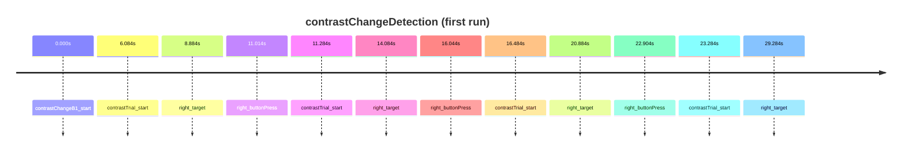

# contrastChangeDetection

Contrast change detection task

- Subjects: 60
- Annotation columns: onset, duration, description, event_code, feedback

## Timeline excerpt

## Sample events
- contrastChangeB1_start
- contrastTrial_start
- right_target
- right_buttonPress

## Extra fields
- **event_code**: break cnt, 94, 5, 9, 13, 8, 12, 9999
- **feedback**: n/a, smiley_face, non_target
