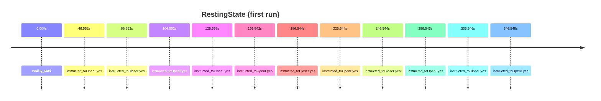

# RestingState

Resting-state eyes open/closed markers

- Subjects: 20
- Annotation columns: onset, duration, description, event_code

## Timeline excerpt

## Sample events
- resting_start
- instructed_toOpenEyes
- instructed_toCloseEyes

## Extra fields
- **event_code**: break cnt, 90, 20, 30, 91, 31, 11, 21, 16, 26
