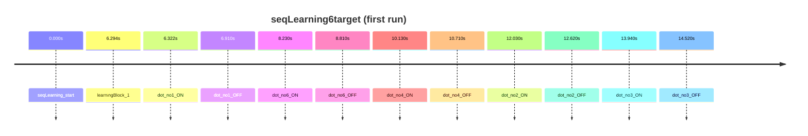

# seqLearning6target

Sequence learning (6 targets)

- Subjects: 8
- Annotation columns: onset, duration, description, correct_answer, event_code, target_count, user_answer

## Timeline excerpt

## Sample events
- seqLearning_start
- learningBlock_1
- dot_no1_ON
- dot_no1_OFF
- dot_no6_ON
- dot_no6_OFF
- dot_no4_ON
- dot_no4_OFF
- dot_no2_ON
- dot_no2_OFF
- dot_no3_ON
- dot_no3_OFF

## Extra fields
- **correct_answer**: n/a, 1-6-4-2-3-5-2
- **event_code**: break cnt, 91, 31, 11, 21, 16, 26, 14, 24, 12
- **target_count**: 6
- **user_answer**: n/a, 1-5-3-6-2-2-4, 1-6-5-3-4-2-3, 1-6-5-3-2-2-4, 1-6-4-2-3-2-5, 6-5-3-2-1-4-5
