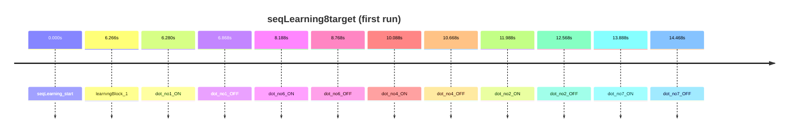

# seqLearning8target

Sequence learning (8 targets)

- Subjects: 11
- Annotation columns: onset, duration, description, correct_answer, event_code, target_count, user_answer

## Timeline excerpt

## Sample events
- seqLearning_start
- learningBlock_1
- dot_no1_ON
- dot_no1_OFF
- dot_no6_ON
- dot_no6_OFF
- dot_no4_ON
- dot_no4_OFF
- dot_no2_ON
- dot_no2_OFF
- dot_no7_ON
- dot_no7_OFF

## Extra fields
- **correct_answer**: n/a, 1-6-4-2-7-3-8-5-2-7
- **event_code**: 91, 31, 11, 21, 16, 26, 14, 24, 12, 22
- **target_count**: 8
- **user_answer**: n/a, 1-6-3-5-5-8-5-4-7-2, 1-6-3-4-7-2-5-8-6-3, 6-1-4-3-7-2-5-8-1-6, 1-6-4-3-7-2-5-8-1-6, 1-6-4-2-7-3-8-4-5-2
