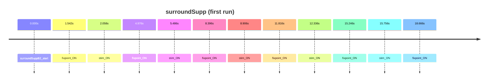

# surroundSupp

Surround suppression flicker events

- Subjects: 40
- Annotation columns: onset, duration, description, background, event_code, foreground_contrast, stimulus_cond

## Timeline excerpt

## Sample events
- surroundSuppB2_start
- fixpoint_ON
- stim_ON

## Extra fields
- **background**: n/a, 1, 0
- **event_code**: break cnt, 97, 4, 8, 9999, 84, 104
- **foreground_contrast**: n/a, 1, 0.6, 0.3, 0
- **stimulus_cond**: n/a, 3, 1, 2
