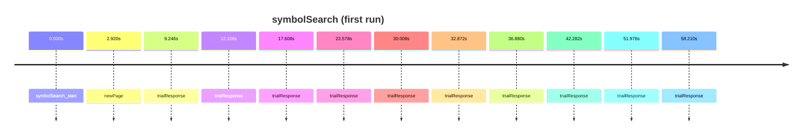

# symbolSearch

Symbol search task

- Subjects: 20
- Annotation columns: onset, duration, description, correct_answer, event_code, user_answer

## Timeline excerpt

## Sample events
- symbolSearch_start
- newPage
- trialResponse

## Extra fields
- **correct_answer**: n/a, 0, 1
- **event_code**: break cnt, 92, 20, 14, boundary
- **user_answer**: n/a, 0, 1
